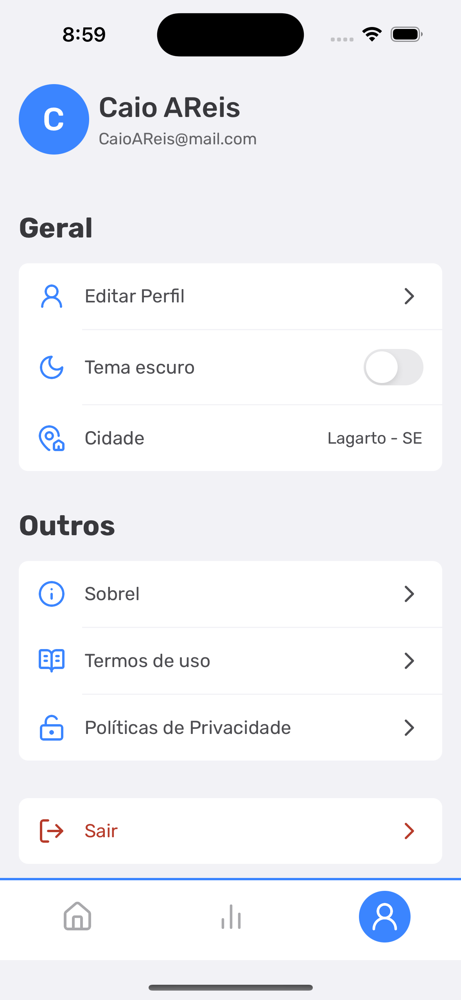
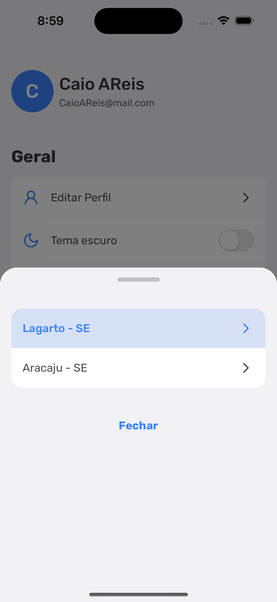

# Busk Lá

## Pré-requisitos

 - Ter o [Expo Go](https://expo.dev/expo-go) instalado.
 - Ter o [NodeJS](https://nodejs.org/) instalado.

## Instalando

Execute o seguinte comando na pasta do projeto:

```js
    npm install
```

## Executando o projeto

Na pasta do app execute o seguinte comando:

```js
    npx expo start
```

Basta lê o QrCode gerado atraves do aplicativo do Expo Go instalado em seu smartphone.

## Resultado
<p align="center" display="flex">
  
  
  
</p>
 
<p align="center" display="flex">
  
  
  
</p>

<p align="center" display="flex">
  
  
  
</p>

<p align="center" display="flex">
  
  
  
</p>

<p align="center" display="flex">
  
  
  
</p>

<p align="center" display="flex">
  
  
  
</p>

## Valeu pela visita! 😉
